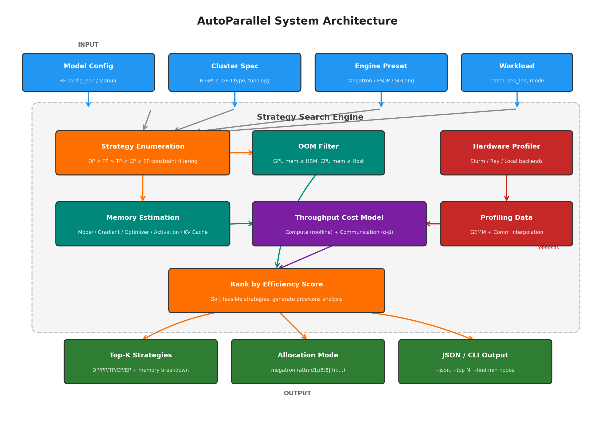
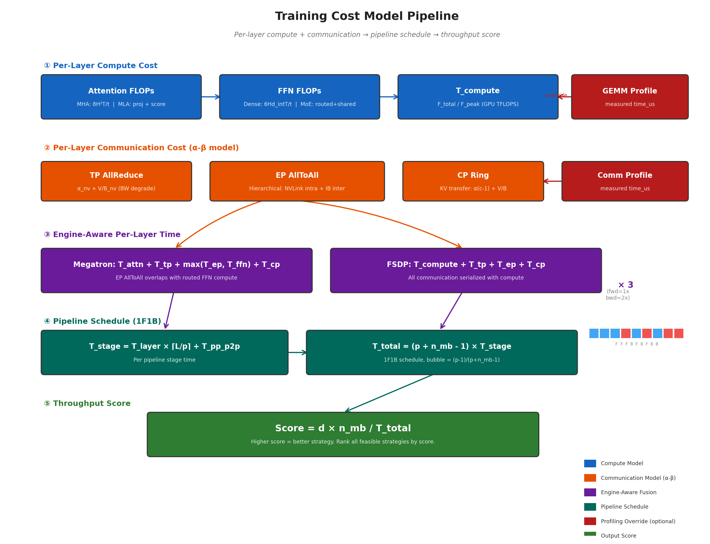
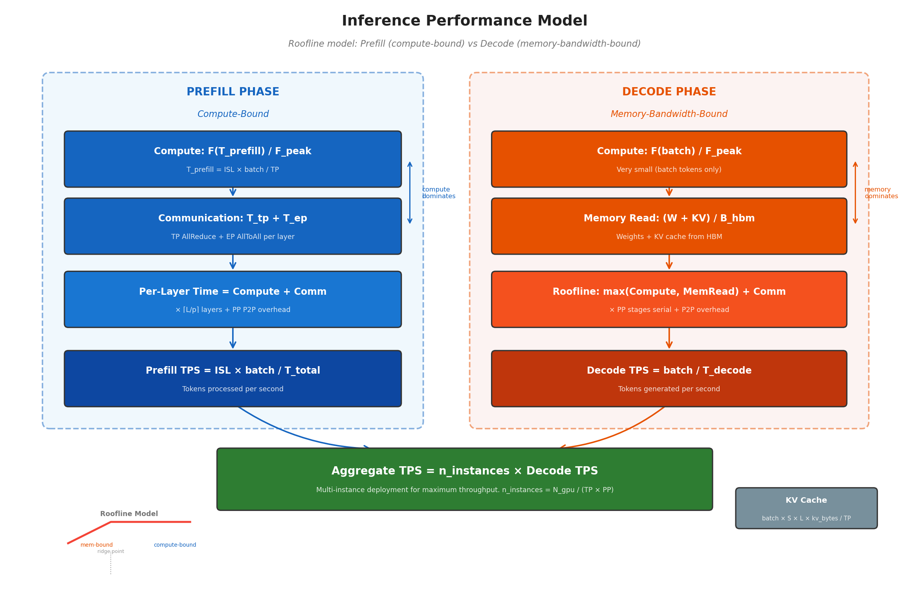

# AutoParallel

[English](README.md) | 中文

LLM 训练与推理的自动并行策略推荐工具。

给定模型架构和 GPU 集群，AutoParallel 枚举所有合法的并行策略组合（DP, PP, TP, CP, EP），估算每张 GPU 的显存占用，基于代价模型对吞吐量排序，推荐最优配置——不 OOM，效率最高。

<p align="center">
  
</p>

## 特性

- **训练 + 推理**：分别搜索训练和推理的最优并行策略，使用引擎特定的代价模型
- **显存估算**：模型参数、梯度、优化器、激活值、KV Cache——逐 GPU 和逐节点 CPU 内存
- **吞吐量建模**：Roofline 计算 + alpha-beta 通信代价模型
- **硬件 Profiling**：可选的 GEMM + 集合通信实测，提升排序精度（~90% → ~98%）
- **广泛模型支持**：Dense、MoE、MLA、GQA、Lightning Attention（详见[支持的模型](#支持的模型)）
- **GPU 预设**：H200、H100、H800、A100、A800，自动带出显存和带宽参数
- **引擎感知**：Megatron、FSDP、SGLang 引擎特有优化（详见[支持的引擎](#支持的引擎)）

## 安装

```bash
pip install autoparallel
```

或从源码安装：

```bash
git clone https://github.com/dingzhiqiang/AutoParallel.git
cd AutoParallel
pip install -e .
```

## 快速开始

AutoParallel 有两种模式：**训练**（默认）和 **推理**。工具读取模型的 HuggingFace `config.json` 自动识别架构（Dense/MoE/MLA/GQA），也可以手动指定模型参数。

### 训练（默认模式）

查找模型在集群上的最优训练并行策略。默认引擎为 **Megatron**——代价模型会考虑 Megatron 特有的优化（EP AllToAll overlap、TP 带宽退化等）：

```bash
# 从 HuggingFace config.json 自动识别模型架构
# 默认：--mode training --engine megatron
python -m autoparallel \
    --model-path /path/to/model --n-gpus 128 --gpu-type H200

# 使用 FSDP 引擎的代价模型
python -m autoparallel \
    --model-path /path/to/model --n-gpus 64 --gpu-type A100 \
    --engine fsdp

# 手动指定模型参数（例如 DeepSeek-V3 风格的 MoE + MLA）
python -m autoparallel \
    --hidden-size 6144 --num-layers 78 --num-heads 64 \
    --num-experts 256 --expert-intermediate-size 2048 \
    --intermediate-size 12288 --vocab-size 154880 \
    --kv-lora-rank 512 --q-lora-rank 2048 \
    --n-gpus 128 --gpu-type H200
```

### 推理

查找最优推理并行策略。默认引擎自动切换为 **SGLang**：

```bash
# 默认：--engine sglang
python -m autoparallel --mode inference \
    --model-path /path/to/model --n-gpus 64 --gpu-type H200 \
    --isl 4096 --osl 512 --infer-batch-size 32
```

### 硬件 Profiling（可选）

运行硬件性能采集，提升排序精度。数据保存在 `~/.cache/autoparallel/`，后续运行自动加载：

```bash
# 自动检测后端（Slurm/Ray/Local），单节点
python -m autoparallel profile

# 双节点 Slurm（同时测量 NVLink + IB）
python -m autoparallel profile --n-nodes 2 --backend slurm
```

## 支持的模型

AutoParallel 读取模型的 HuggingFace `config.json` 自动识别架构。任何使用标准 HuggingFace config 字段的模型都可以使用。已验证的模型包括：

| 架构 | 代表模型 | 自动识别的关键字段 |
| --- | --- | --- |
| **Dense Transformer** | LLaMA, LLaMA-2/3, GPT, Qwen-2/2.5 | `hidden_size`, `num_attention_heads`, `intermediate_size` |
| **GQA** | LLaMA-2/3, Qwen-2/2.5, GLM-4 | `num_key_value_heads` < `num_attention_heads` |
| **MoE** | DeepSeek-V2/V3, Qwen-MoE, Ling-MoE | `n_routed_experts`, `num_experts_per_tok`, `moe_intermediate_size` |
| **MLA** | DeepSeek-V2/V3, GLM-5.1 | `kv_lora_rank`, `q_lora_rank`, `qk_nope_head_dim` |
| **MoE + MLA** | DeepSeek-V3, GLM-5.1 | 同时包含 MoE 和 MLA 字段 |
| **Lightning Attention** | GLM-5.1 | `group_norm_size` / `layer_group_size` |
| **first-k dense replace** | DeepSeek-V3, GLM-5.1 | `first_k_dense_replace`（前 N 层用 Dense FFN） |

> **注意**：任何 HuggingFace 格式的模型（含 `config.json`）都可以使用——AutoParallel 只读取架构配置，不加载模型权重。

## 支持的引擎

`--engine` 参数选择代价模型预设。不同引擎的运行时行为不同，影响并行效率：

| 引擎 | 用途 | 默认场景 | 代价模型关键假设 |
| --- | --- | --- | --- |
| **megatron** | 训练 | `--mode training` | EP AllToAll 与 FFN 计算重叠；TP>4 时带宽退化；MoE 激活因子=18 |
| **fsdp** | 训练 | — | EP AllToAll 与 FFN 串行；无 TP 带宽退化；MoE 激活因子=14 |
| **sglang** | 推理 | `--mode inference` | EP AllToAll 与 FFN 重叠；无 TP 带宽退化；MoE 激活因子=14 |

**为什么引擎选择很重要**：Megatron 引擎将 EP AllToAll dispatch/combine 与专家 FFN 计算重叠执行（`代价 = max(ep_time, ffn_time)`），而 FSDP 串行执行（`代价 = ep_time + ffn_time`）。对于 MoE 模型，这会显著改变最优的 TP/EP 组合。

```bash
# 训练 + Megatron 代价模型（默认）
python -m autoparallel --model-path /path/to/model --n-gpus 128

# 训练 + FSDP 代价模型
python -m autoparallel --model-path /path/to/model --n-gpus 128 --engine fsdp

# 推理 + SGLang 代价模型（推理模式默认）
python -m autoparallel --mode inference --model-path /path/to/model --n-gpus 64
```

## CLI 参数

### 模式

| 参数 | 默认 | 说明 |
| --- | --- | --- |
| `--mode {training,inference}` | `training` | 训练或推理模式 |

### 模型（自动识别）

| 参数 | 说明 |
| --- | --- |
| `--model-path PATH` | HF 模型目录（含 config.json） |

### 模型（手动指定）

| 参数 | 默认 | 说明 |
| --- | --- | --- |
| `--hidden-size` | 4096 | 隐藏维度 |
| `--num-layers` | 32 | Transformer 层数 |
| `--num-heads` | 32 | 注意力头数 |
| `--num-kv-heads` | = num-heads | KV 头数（GQA） |
| `--intermediate-size` | 11008 | FFN 中间维度 |
| `--vocab-size` | 32000 | 词表大小 |
| `--num-experts` | 0 | MoE 专家数 |
| `--num-experts-per-tok` | 0 | 每 token 激活专家数 |
| `--expert-intermediate-size` | 0 | 专家 FFN 中间维度 |
| `--n-shared-experts` | 0 | 共享专家数 |
| `--kv-lora-rank` | 0 | MLA KV LoRA 秩 |
| `--q-lora-rank` | 0 | MLA Q LoRA 秩 |
| `--group-norm-size` | 0 | Lightning Attention GroupNorm 大小 |
| `--first-k-dense-replace` | 0 | 前 k 层用 Dense FFN |

### 集群

| 参数 | 默认 | 说明 |
| --- | --- | --- |
| `--n-gpus` | 128 | GPU 总数 |
| `--gpus-per-node` | 8 | 每节点 GPU 数 |
| `--gpu-type` | H200 | GPU 型号预设 (H200/H100/H800/A100/A800) |
| `--gpu-memory-gb` | 自动 | 覆盖 GPU 显存 (GB，0=用预设值) |
| `--host-memory-gb` | 自动 | 覆盖节点 CPU 内存 (GB) |
| `--gpu-flops` | 自动 | 覆盖 BF16 TFLOPS |
| `--bw-nvlink` | 自动 | 覆盖 NVLink 带宽 (GB/s) |
| `--bw-ib` | 自动 | 覆盖 IB 带宽 (GB/s) |

**GPU 预设值**：

| GPU 型号 | 显存 | 节点内存 | BF16 TFLOPS | NVLink BW | IB BW |
| --- | --- | --- | --- | --- | --- |
| H200 | 141 GB | 1500 GB | 990 | 450 GB/s | 50 GB/s |
| H100 | 80 GB | 1000 GB | 990 | 450 GB/s | 50 GB/s |
| H800 | 80 GB | 1000 GB | 990 | 400 GB/s | 50 GB/s |
| A100 | 80 GB | 1000 GB | 312 | 300 GB/s | 25 GB/s |
| A800 | 80 GB | 1000 GB | 312 | 200 GB/s | 25 GB/s |

### 训练参数

| 参数 | 默认 | 说明 |
| --- | --- | --- |
| `--max-tokens-per-mb` | 131072 | 每 micro-batch 最大 token 数 |
| `--max-length` | 16384 | 序列最大长度 |
| `--batch-size` | 0 | 全局 batch size（0=不约束 DP） |
| `--engine` | megatron | 引擎预设 (megatron/fsdp/sglang) |
| `--no-optimizer-cpu-offload` | false | 禁用 optimizer CPU offload |
| `--no-recompute` | false | 禁用 activation recompute |
| `--no-grad-reduce-in-fp32` | false | 用 bf16 梯度累加 |

### 推理参数

| 参数 | 默认 | 说明 |
| --- | --- | --- |
| `--isl` | 4096 | 输入序列长度 |
| `--osl` | 512 | 输出序列长度 |
| `--infer-batch-size` | 32 | 推理并发 batch size |

### Profiling

| 参数 | 说明 |
| --- | --- |
| `--profile-data PATH` | 指定 profiling JSON 路径 |
| `--no-profile` | 禁用 profiling 数据，纯解析模型 |

### 输出

| 参数 | 说明 |
| --- | --- |
| `--json` | JSON 格式输出 |
| `--top N` | 只显示 top N（0=全部） |
| `--find-min-nodes` | 搜索最少节点数 |

## 引擎配置详解

代价模型的部分优化假设与引擎实现相关，通过 `--engine` 参数选择预设：

| 优化 | Megatron | FSDP | SGLang |
| --- | --- | --- | --- |
| EP AllToAll 与 FFN 重叠 | Yes | No | Yes |
| TP 带宽退化（TP>4） | Yes | No | No |
| MoE activation factor | 18 | 14 | 14 |

- **Megatron**：AllToAll dispatch/combine 与 expert FFN 计算重叠执行，代价 = max(ep_time, ffn_time)
- **FSDP**：AllToAll 和 FFN 串行执行，代价 = ep_time + ffn_time
- **SGLang**：推理引擎，AllToAll 重叠但无 TP 带宽退化建模

## 显存估算

### GPU 显存（per-rank）

| 组件 | 说明 |
| --- | --- |
| Model | 模型参数，按 TP/PP/EP 分片 |
| DDP Buffer | 梯度通信缓冲区（不分片） |
| Gradient | fp32 梯度分片（仅 !grad_reduce_in_fp32） |
| Optimizer | Adam 状态 12 bytes/param / dp（仅 !cpu_offload） |
| Activation | 检查点 + 工作显存，按 TP 分片 |
| CUDA Context | 8GB + 1GB × 通信组数 |

### CPU 内存（per-node）

当 `optimizer_cpu_offload=True`（默认）时，optimizer states 占 CPU 内存。超出 `host_memory_gb` 的策略标记为 `CPU!`。

## 输出示例

### 训练模式

```
============================================================================
Model: 786.3B params | MoE=True (256 experts) | MLA=True | Layers=78
max_tokens_per_mb=16384 | GPU=140GB | Host=1500GB/node | Engine=megatron
============================================================================
  #  DP  PP  TP  CP   EP  Tok/GPU  Layers Exp/R   Model  GrdBuf  ...  Fit?
----------------------------------------------------------------------------
  1   1   4  16   1   16    16384   19-20    16   24.1G   48.3G  ...   OK
  ...

Top-3 Recommended (by estimated throughput)
======================================================================
  #1  megatron:(attn:d1p8t8|ffn:d1p8e8)
      DP=1  PP=8  TP=8  CP=1  EP=8
      GPU: 95.2G / 140G (margin 45G)
      Score: 41.159 (100%)
       + TP=8 节点内 NVLink
       + PP=8 bubble 10%
       + EP=8 节点内 NVLink AllToAll
```

### 推理模式

```
Top-3 Recommended (by aggregate decode throughput)
======================================================================
  #1  tp1_ep8  (8 GPUs/instance x 8 instances)
      Memory: 33.3G / 140G | KV capacity: ~580K tokens
      Prefill: 12.3 ms (333K tok/s/inst)
      Decode:  8.1 ms/tok (123 tok/s/inst)
      Aggregate: 984 tok/s (100%)
```

## 代价模型

<p align="center">
  
</p>

<p align="center">
  
</p>

1. **ALPA alpha-beta 通信模型**：对 TP AllReduce、EP AllToAll、CP Ring 分别建模
2. **分层 EP AllToAll**：区分 NVLink 节点内和 IB 跨节点的流量比例
3. **引擎感知优化**：EP overlap、TP BW degradation（Megatron 特有）
4. **Roofline 推理模型**：Prefill compute-bound，Decode memory-bandwidth-bound
5. **Profiling 插值**（可选）：实测 GEMM + 通信数据，对数空间插值替代解析估算

详见 [DESIGN.md](DESIGN.md)。

## 与其他系统对比

| 特性 | AutoParallel | [Galvatron](https://github.com/PKU-DAIR/Hetu-Galvatron) | [Alpa](https://github.com/alpa-project/alpa) | [ColossalAI](https://github.com/hpcaitech/ColossalAI) | DeepSpeed |
| --- | --- | --- | --- | --- | --- |
| **方法** | 纯推荐器 | Profiler + 搜索 + 运行时 | ILP + DP 搜索 | 配置驱动 | ZeRO 配置 |
| **DP/PP/TP** | ✓ | ✓ | ✓ | ✓ | ✓ |
| **EP（专家并行）** | ✓ | ✓ | ✗ | ✓ | ✓ (MoE) |
| **CP（上下文并行）** | ✓（MLA 感知） | ✗ | ✗ | ✗ | ✗ |
| **ZeRO stages** | ✗（计划中） | ✓ (1/2/3) | ✗ | ✓ | ✓ (1/2/3/Infinity) |
| **序列并行** | ✗（计划中） | ✓ (Megatron-SP, Ulysses) | ✗ | ✓ | ✗ |
| **MLA 支持** | ✓ | ✗ | ✗ | ✗ | ✗ |
| **FP8/量化** | ✗（计划中） | ✗ | ✗ | ✓ | ✗ |
| **推理模式** | ✓（Roofline） | ✗ | ✗ | ✗ | ✗ |
| **引擎感知** | ✓（Megatron/FSDP/SGLang） | ✗ | ✗ | ✗ | ✗ |
| **GPU 依赖** | 无 | 需要 Profiling | ILP 求解器 | 运行时 | 运行时 |
| **训练支持** | ✓ | ✓ | ✓ | ✓ | ✓ |
| **搜索算法** | 枚举 | 动态规划 | ILP | 配置 | 配置 |


**AutoParallel 的差异化优势**：
1. 训练 + 推理统一推荐，一个工具覆盖两种场景
2. 引擎感知代价模型（Megatron EP overlap、TP 带宽退化）
3. MLA 感知的 CP 代价计算（仅标准 MHA 的 3.5%）
4. 零 GPU 依赖——仅需 config.json，秒级完成推荐

## 路线图

### 近期

- [ ] **FP8 / 量化支持** — 建模权重精度（FP8 E4M3、INT8、INT4/AWQ/GPTQ）。
  FP8 将权重内存减半（2→1 bytes/param），在 H100/H200 上峰值 FLOPS 翻倍。
  许多生产模型（DeepSeek-V3、Qwen3.5-FP8）已原生支持 FP8 权重。
  实现方案：添加 `--precision {bf16,fp8,int8,int4}` 参数，相应调整 `dtype_bytes`
  和 `gpu_flops`。

- [ ] **更多推理引擎** — 添加 vLLM 和 TensorRT-LLM 引擎预设。
  SGLang cookbook 已覆盖三种引擎；代价模型差异较小
  （内存分配策略、chunked prefill、prefix caching）。
  实现方案：添加 `VLLM_ENGINE` 和 `TRTLLM_ENGINE` 配置。

- [ ] **ZeRO stages** — 建模 ZeRO-1（优化器分片）、ZeRO-2（+梯度分片）、
  ZeRO-3（+参数分片），用于 FSDP/DeepSpeed 训练。
  修改优化器和梯度的显存计算公式。

### 中期

- [ ] **序列并行（激活显存优化）** — 建模 Megatron-SP 对激活显存的优化
  （TP 组内对 LayerNorm 激活做 ReduceScatter/AllGather）。
  注意：SP 与 CP 不同——SP 将激活显存从 O(s) 降到 O(s/tp)，
  影响显存公式但不增加新的并行维度。

- [ ] **多阶段 RL 工作流** — 建模 RLHF/GRPO 在共享 GPU 集群上的
  rollout（推理）+ 训练阶段的资源分配。

- [ ] **交互式 Web UI** — 浏览器界面，用于探索策略、对比配置、
  可视化显存/吞吐量权衡。

### 长期

- [ ] **NVSwitch / 异构拓扑** — 建模 NVSwitch all-to-all 带宽
  （对比 ring-based NVLink）和非对称互联拓扑。

- [ ] **自动 Profiling 集成** — 一键硬件性能采集 + 代价模型自动校准。
  目前 profiling 是可选的 Layer 2；目标是做到无缝集成。

- [ ] **CI/CD 集成** — 在提交作业前验证并行配置。
  `autoparallel check --config train.yaml`，在浪费 GPU 时间前拦截 OOM。

- [ ] **多模型服务** — 共享集群上多模型服务的代价模型
  （模型复用、显存共享）。

## 验证

AutoParallel 的推荐已通过以下方式交叉验证：

- **GLM-5.1 训练**（128×H200）：4 种策略实测对比，显存误差 <5%，正确识别最优策略（TP=8 CP=2，37.6s/step）
- **BailingMoE CP 扩展**（64×H200）：CP=4→CP=8 实现 2.25 倍加速，验证 MLA 感知的 CP 代价模型
- **MLA CP 验证**（GLM-5.1）：CP=4 vs CP=8 step time 差异 <2%——确认 KV 传输量仅为标准 MHA 的 3.5%
- **SGLang 官方 cookbook**：TP/EP 推荐与 SGLang 的[自动 benchmark 配置](https://github.com/sgl-project/sglang/tree/main/.claude/skills/llm-serving-auto-benchmark/configs/cookbook-llm)对齐
- **Qwen 模型系列**：7 个模型从 8B 到 397B 测试（Dense、MoE、GQA）

详见 [BENCHMARK.md](BENCHMARK.md)（[中文](BENCHMARK_zh.md)）。

## 文档

| 文档 | 说明 |
| --- | --- |
| [README.md](README.md)（[中文](README_zh.md)） | 快速开始和 CLI 参考 |
| [DESIGN.md](DESIGN.md) | 技术设计文档（含公式推导和核心设计决策） |
| [BENCHMARK.md](BENCHMARK.md)（[中文](BENCHMARK_zh.md)） | 真实环境验证结果 |

## 参考

- [Alpa](https://github.com/alpa-project/alpa) — JAX 自动并行框架
- [Galvatron](https://github.com/PKU-DAIR/Hetu-Galvatron) — 自动并行优化系统
- XLA matmul/collective 插值模型

## 许可证

Apache License 2.0
